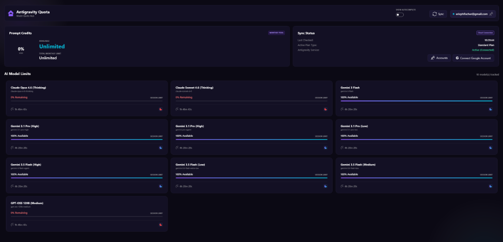
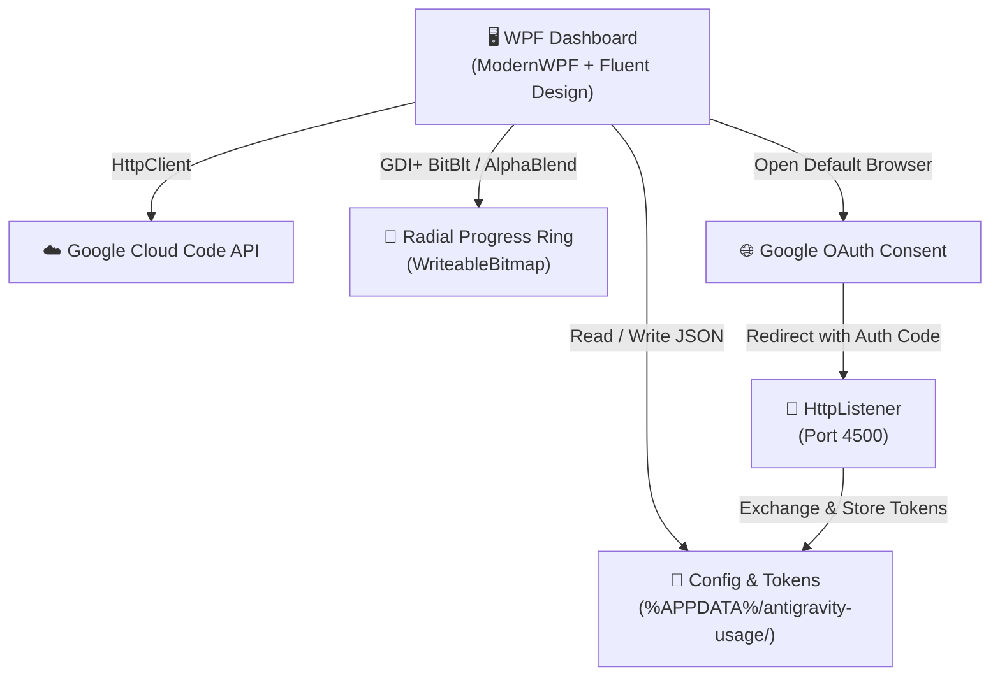
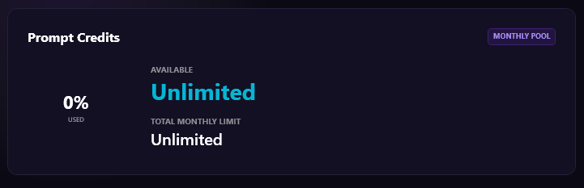
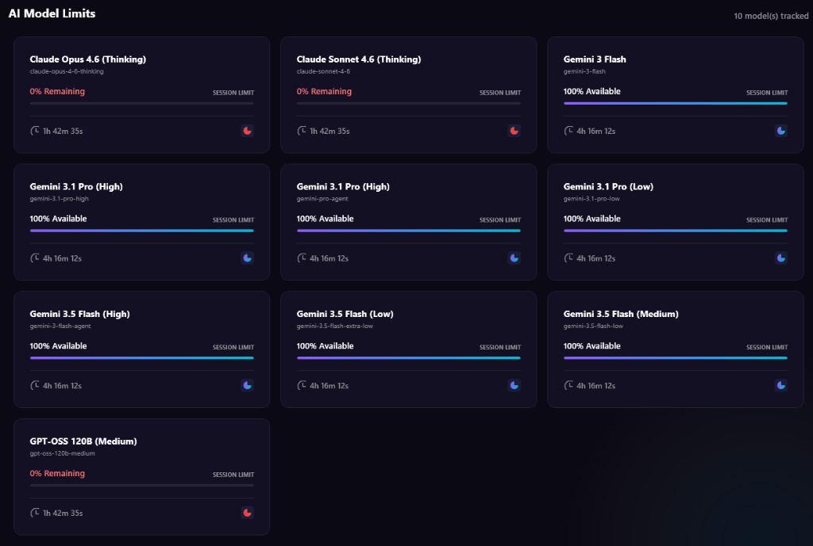

<div align="center">

# ⚡ Antigravity Quota

**A native Windows desktop dashboard for monitoring your AI model quotas, prompt credits, and usage limits in real-time.**



[](https://dotnet.microsoft.com/)
[](https://github.com/Kinnara/ModernWpf)
[](LICENSE)
[](https://www.microsoft.com/windows)

---

</div>

## 🎯 What is this?

Antigravity Quota is a sleek, self-contained Windows application that connects directly to the **Google Cloud Code API** to display your current AI model quotas, prompt credit balances, and reset timers — all in one glassmorphic dashboard.

No browser tabs. No CLI tools. No Node.js. Just a single `.exe` you double-click.

---

## ✨ Features

| Feature | Description |
|---|---|
| **📊 Prompt Credits Widget** | Radial progress ring rendered via native GDI+ showing your monthly credit pool usage |
| **🤖 Model Quota Grid** | Live cards for every AI model (Gemini, Claude, GPT, etc.) with remaining percentage and countdown timers |
| **🔐 Google OAuth** | Secure login via your default browser — tokens stored locally in `%APPDATA%` |
| **👥 Multi-Account Manager** | Add multiple Google accounts, switch between them instantly |
| **⏱ Live Countdown Timers** | Per-model reset countdowns that tick every second |
| **🎨 Fluent Design** | Windows 11 native look & feel using ModernWPF with glassmorphism and ambient glow effects |
| **📦 Single-File EXE** | Self-contained — no runtime installation required |

---

## 🚀 Quick Start

### Option A: Download the Release

1. Go to [**Releases**](https://github.com/adorableAppa/antigravity-quota/releases)
2. Download `AntigravityQuota.exe`
3. Double-click and run

### Option B: Build from Source

```bash
# Clone the repository
git clone https://github.com/adorableAppa/antigravity-quota.git
cd antigravity-quota

# Build and run
dotnet run

# Or publish a self-contained single-file executable
dotnet publish -c Release -r win-x64 --self-contained true -p:PublishSingleFile=true
```

The compiled executable will be in `bin/Release/net8.0-windows/win-x64/publish/`.

---

## 🔧 Requirements

| Requirement | Details |
|---|---|
| **OS** | Windows 10 (1903+) / Windows 11 |
| **Runtime** | None (self-contained) — or .NET 8.0 SDK for building from source |
| **Google Account** | Required for API access to fetch quota data |

---

## 🏗 Architecture



---

## 🧰 Tech Stack

| Layer | Technology |
|---|---|
| **Language** | C# 12 |
| **Framework** | WPF + [ModernWPF](https://github.com/Kinnara/ModernWpf) (Fluent Design) |
| **Runtime** | .NET 8.0 |
| **Graphics** | Win32 GDI+ (`BitBlt`, `AlphaBlend` via P/Invoke) |
| **HTTP** | `System.Net.Http.HttpClient` (direct REST calls) |
| **Auth** | OAuth 2.0 PKCE via `HttpListener` loopback |
| **Persistence** | JSON files in `%APPDATA%/antigravity-usage/` |

---

## 📁 Project Structure

```
Antigravity Quota/
├── AntigravityQuota.csproj   # Project file (.NET 8.0-windows)
├── App.xaml                  # Application entry + theme resources
├── App.xaml.cs
├── MainWindow.xaml           # Dashboard layout (Fluent UI)
├── MainWindow.xaml.cs        # Window logic, timers, account management
├── ConfigService.cs          # JSON config & account token storage
├── QuotaService.cs           # Google Cloud Code API client
├── OAuthServer.cs            # Loopback HTTP server for OAuth callbacks
├── GdiInterop.cs             # Win32 P/Invoke declarations
├── RadialProgress.xaml       # Custom GDI+ radial progress control
├── RadialProgress.xaml.cs
├── Models.cs                 # Data models (ModelQuota, PromptCredits, etc.)
└── README.md
```

---

## 🔑 How Authentication Works

1. Click **"Connect Google Account"** in the dashboard
2. Your default browser opens the Google OAuth consent screen
3. After granting access, Google redirects to `http://127.0.0.1:4500/callback`
4. The app's built-in `HttpListener` captures the auth code
5. Tokens are exchanged and stored locally in `%APPDATA%/antigravity-usage/accounts/<email>/tokens.json`
6. Access tokens are automatically refreshed when they expire

> **Note:** Your credentials never leave your machine. All tokens are stored locally and all API calls are made directly from your desktop.

---

## 👥 Multi-Account Support

- Add multiple Google accounts via **"Connect Google Account"**
- When 2+ accounts are registered, an **"Accounts"** manager button appears automatically
- Switch between accounts instantly — quota data refreshes for the selected account
- Remove accounts with one click

---

## 📸 Screenshots

<div align="center">

| Prompt Credits & Sync Status | Model Quota Grid |
|:---:|:---:|
|  |  |

</div>

## 🛣 Roadmap

- [x] **System Tray Mode (Minimize to Tray):** Run the app in the background and restore the dashboard by clicking the tray icon
- [x] **Windows Toast Notifications:** Get notified when a model quota is reset or completely exhausted
- [x] **Start with Windows (Autostart):** Option to launch the app automatically at system startup
- [ ] **Global Hotkey:** Quickly summon or hide the dashboard from anywhere with a keyboard shortcut (e.g., `Alt+Q`)
- [x] **Theme Selector:** Manually switch between Dark and Light modes (in addition to following the Windows system theme)
- [x] **Configurable Sync Interval:** Option for automatic background quota refreshes (e.g., every 30 minutes)

---

## 📄 License

This project is licensed under the [MIT License](LICENSE).

---

<div align="center">

**Built with ❤️ and C# — no Electron, no Node.js, just native Windows.**

</div>
